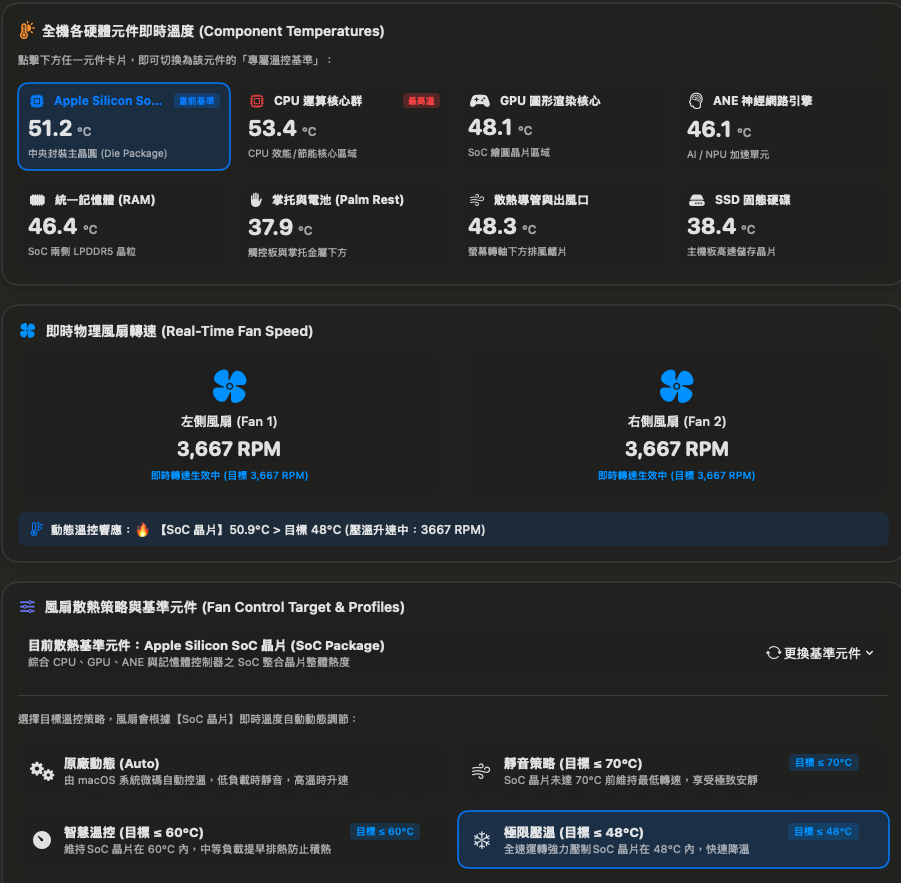
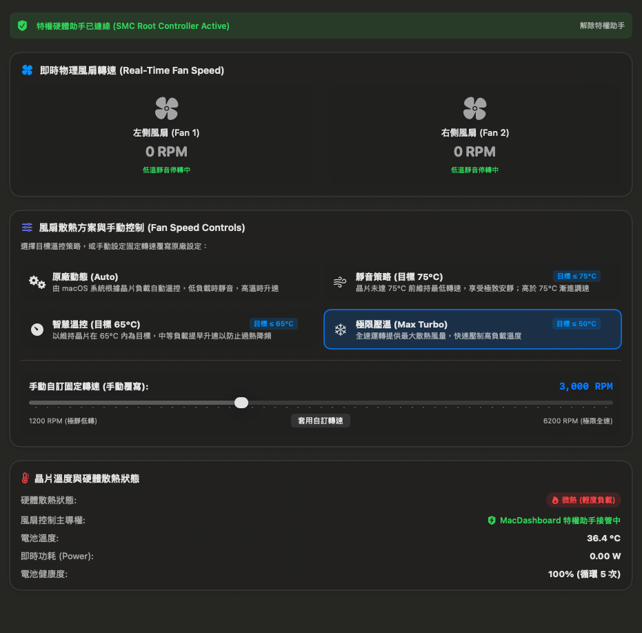
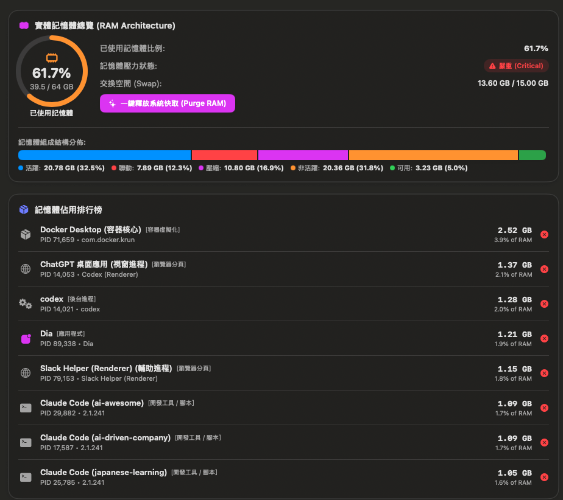

<div align="center">

# 🛠️ MacDashboard (Mac Tool Kit)

**The Ultimate High-Performance System Monitor, Lag Detective & Closed-Loop Thermal Controller for Apple Silicon & macOS.**

[](https://www.apple.com/macos/)
[](https://swift.org/)
[](LICENSE)
[](https://github.com/PeterTing/mac-tool-kit/releases/latest)

<p align="center">
  Built natively with <b>Swift 6 (Strict Concurrency)</b> and <b>SwiftUI</b>.<br>
  Engineered for ultra-low resource overhead, AI agent process tracing, Docker container breakdown, and sensor-based thermal management.
</p>

[📥 Download DMG / ZIP](https://github.com/PeterTing/mac-tool-kit/releases/latest) •
[💡 Features](#-key-features) •
[📖 Usage Guide](#-usage-guide) •
[🤝 Contributing](#-contributing) •
[🐛 Report Issue](https://github.com/PeterTing/mac-tool-kit/issues)

---

</div>

## 📸 Screenshots

### 1. 8-Component Thermal Dashboard & Closed-Loop Fan Control
> Select specific hardware components as fan cooling targets (e.g. actively cool the Palm Rest during heavy typing, or suppress Apple Silicon SoC hotspots). Powered by an industrial **-7°C thermal hysteresis anti-hunting algorithm** to eliminate annoying fan toggling.

<div align="center">
  
</div>

<br>

### 2. Full-Spectrum Overview Dashboard
> Real-time CPU core breakdown (P-Cores & E-Cores), RAM architecture composition, NVMe SSD read/write throughput, network upload/download sparklines, and battery health analytics.

<div align="center">
  
</div>

<br>

### 3. RAM Architecture & One-Click Cache Purge (Memory Inspector)
> Deep inspection of Active, Wired, Compressed, and Inactive memory. Features detailed **Docker per-container RAM breakdown** and **One-Click Purge System Cache**.

<div align="center">
  
</div>

<br>

### 4. Smart Process Inspector & AI Root Tracing
> Traces the root origin of background processes (e.g., identifies scripts spawned by Claude Code, Antigravity, Cursor, uv, or Warp) instead of showing opaque process names.

<div align="center">
  
</div>

---

## 🌟 Key Features

### 🔍 1. AI Model & Session ID Root Attribution
- **Beyond Opaque Activity Monitor**: Modern AI coding tools (Claude Code, Cursor, Antigravity, Ollama) spawn numerous background Python, Node, and test runner processes. MacDashboard automatically extracts and correlates:
  - **AI Tool & Agent Name**: (e.g. `Claude Code`, `Antigravity Agent`, `Cursor AI`, `Ollama / Local LLM`).
  - **Active AI Model**: (e.g. `claude-3-7-sonnet`, `deepseek-r1:14b`, `gemini-2.5-pro`, `gpt-4o`).
  - **Session & Conversation ID**: (e.g. `#a9f7d8`, `#01J8K9`) directly tied to real-time CPU/RAM spikes.
  - **Workspace & Task**: The underlying repository project and active task (e.g. `pytest unit tests`, `swift build`).
  - **One-Click Safe Session Termination**: Stop runaway agent loops without guessing cryptic PIDs.

### 🐳 2. Docker Per-Container Resource Breakdown
- **No More 8GB Mystery**: Instead of showing `com.docker.krun` as a single opaque 7GB+ memory block, MacDashboard breaks down each active container's individual RAM footprint, CPU%, and image tag.

### 🍃 3. Monitoring Profiles & Eco Fan-Only Mode (< 0.05% CPU)
- **⚡ Real-time (1s)**: Full-spectrum second-by-second analytics (~2-4% CPU).
- **⚖️ Balanced (3s)**: Lightweight 3-second sampling (~0.5-1% CPU).
- **🍃 Eco Fan-Only Mode**: Suspends all heavy process scans and Docker CLI polling while continuously driving closed-loop fan thermal regulation with negligible (< 0.05%) CPU overhead.

### ❄️ 4. Sensor-Based Closed-Loop Fan Control
- **8 Dedicated Thermal Sensors**:
  - 💻 **Apple Silicon SoC Package**: Whole-die aggregated temperature.
  - 🖥️ **CPU Performance/Efficiency Cores**
  - 🎮 **GPU Graphics Cluster**
  - 🧠 **ANE Neural Engine (AI NPU)**
  - ⚡ **Unified LPDDR5 RAM**
  - 🖐️ **Palm Rest & Battery**: Combines physical battery telemetry with unibody aluminum thermal conduction.
  - 🌪️ **Heatsink & Exhaust Fins**
  - 💾 **NVMe SSD Storage**: Dynamic scaling based on real-time I/O throughput.
- **-7°C Thermal Hysteresis & Anti-Hunting**:
  - Ramp-up threshold: $\ge \text{Target} + 0.8^\circ\text{C}$.
  - Spin-down / stop threshold: $< \text{Target} - 7.0^\circ\text{C}$.
  - Eliminates rapid start-stop fan noise around critical temperature thresholds.
- **Privileged Hardware Control**: Compatible with macOS SMC root helper protocol and manual RPM slider override (1,200 ~ 6,200 RPM).

### ⚡ 5. Lag Detective (Instant Bottleneck Diagnosis)
- Sub-second cross-correlation of CPU spikes, AI agent runaway sessions, memory exhaustion, swap thrashing, and thermal throttling with one-click remedies.

---

## 📖 Usage Guide

### 1. Download & Installation
1. Download **`MacDashboard-v1.0.0-macOS.dmg`** from [Releases](https://github.com/PeterTing/mac-tool-kit/releases/latest).
2. Open the DMG and drag **`MacDashboard`** into your **`Applications`** folder.
3. Launch `MacDashboard` from Applications or Spotlight.

### 2. Enabling Hardware Fan Control (SMC Privilege)
1. Navigate to the **Thermal & Fan** tab in the sidebar.
2. Click **Enable Hardware Fan Control (Requires Authorization)**.
3. Enter your macOS administrator password to authorize the lightweight privileged helper tool.
4. You can now select custom thermal profiles or manually lock fan speeds.
5. Click **Uninstall Privileged Helper** anytime to instantly restore default Apple auto-thermal control.

### 3. Targeting Palm Rest Cooling
1. Under **Component Temperatures**, click the **Palm Rest & Battery** card.
2. Select **Balanced Cooling (Target ≤ 34°C)**.
3. When the palm rest exceeds 34°C during intense typing, fans actively spin up to cool the metal chassis back to a comfortable zone!

---

## 🛠️ Building from Source

```bash
# 1. Clone the repository
git clone https://github.com/PeterTing/mac-tool-kit.git
cd mac-tool-kit

# 2. Run test suite (10/10 tests)
make test

# 3. Build Release App to /Applications
make release

# 4. Generate distributable DMG and ZIP packages
make dmg
# Artifacts are generated in dist/ directory
```

---

## 🤝 Contributing

Contributions are warmly welcomed! Please check out [**CONTRIBUTING.md**](CONTRIBUTING.md) for branch naming conventions, Conventional Commits, and Swift 6 Strict Concurrency guidelines.

---

## 🐛 Issues & Feedback

Found a bug or have an idea for a new feature?
- 🐞 **[Submit a Bug Report](https://github.com/PeterTing/mac-tool-kit/issues/new?template=bug_report.md)**
- 💡 **[Request a New Feature](https://github.com/PeterTing/mac-tool-kit/issues/new?template=feature_request.md)**

---

## 📜 License

This project is licensed under the [MIT License](LICENSE).
