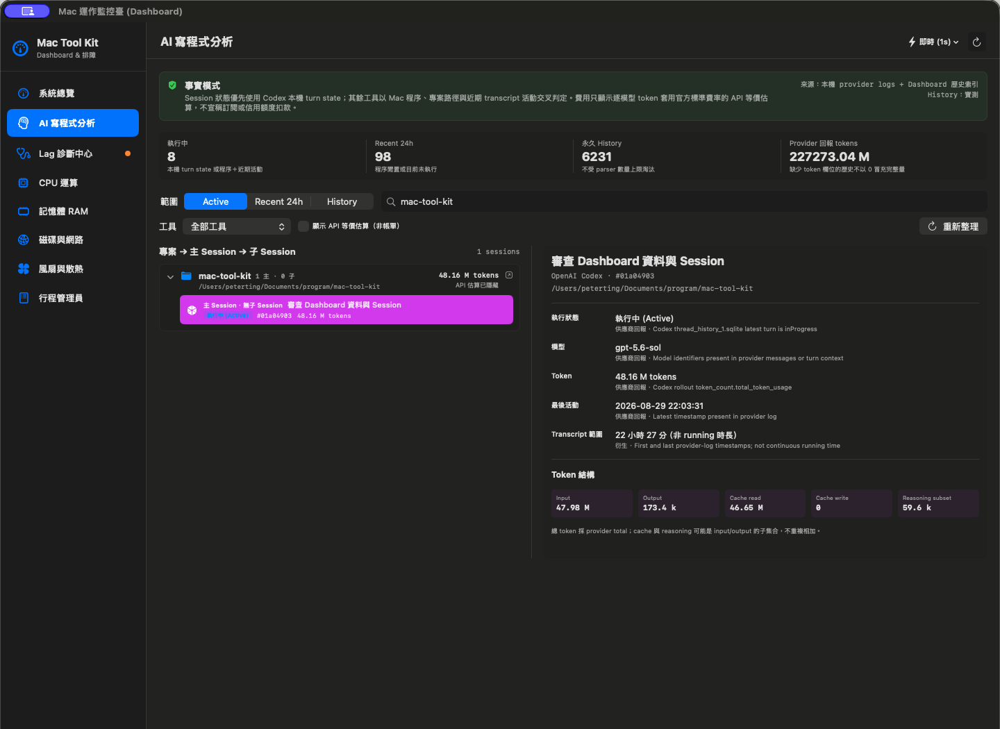
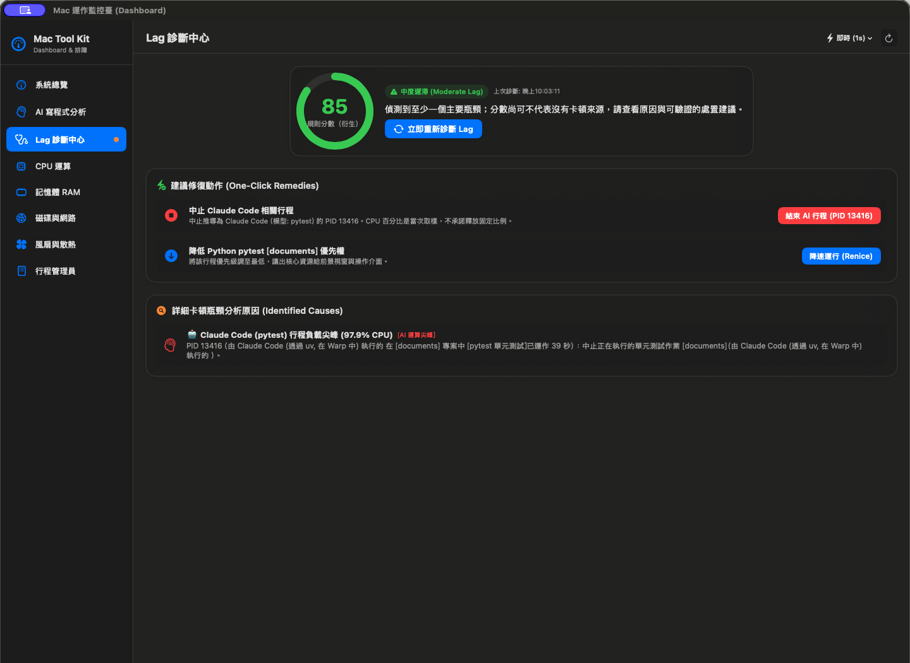
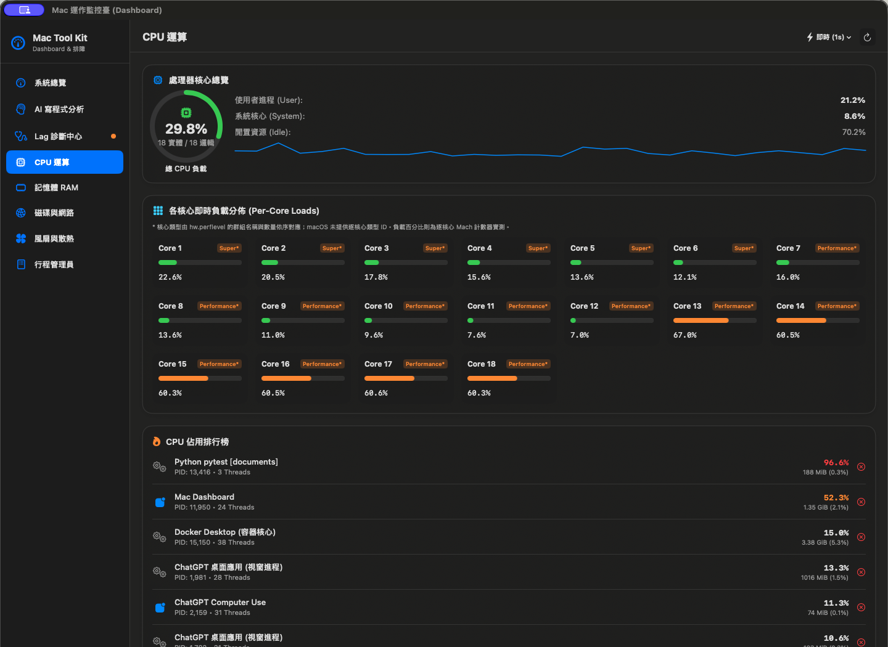
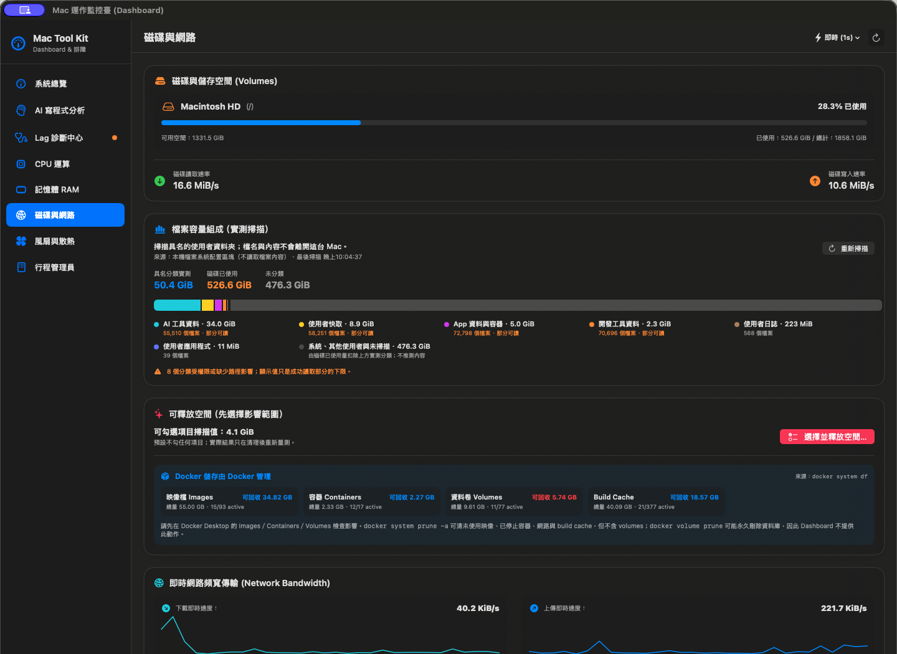

<div align="center">

# MacDashboard (Mac Tool Kit)

**A source-aware macOS operations dashboard for CPU, memory, storage, network, thermal sensors, fans, processes, Docker, and AI coding sessions.**

[](https://www.apple.com/macos/)
[](https://swift.org/)
[](LICENSE)
[](https://github.com/PeterTing/mac-tool-kit/releases/latest)

Built natively with SwiftUI. Values that cannot be verified are omitted or labelled with their evidence boundary instead of being invented.

[Download DMG / ZIP](https://github.com/PeterTing/mac-tool-kit/releases/latest) ·
[Release notes](docs/releases/v1.3.1.md) ·
[Build from source](#build-from-source) ·
[Report an issue](https://github.com/PeterTing/mac-tool-kit/issues)

</div>

## Trust contract

MacDashboard is designed as an inspectable dashboard, not a collection of plausible-looking numbers:

- Measured values identify their macOS, provider-log, process, filesystem, or Docker source.
- Derived values are labelled as derived and document the rule used.
- Missing evidence stays unavailable or is omitted; it is never replaced with a guessed component temperature, session state, token count, or charge.
- AI costs are optional **API-equivalent estimates** from provider-reported model and token fields. They are not subscription spend, credits, or billing statements.
- Destructive actions require an explicit selection and confirmation. Docker volumes are never included in one-click cleanup.

Screenshots below are direct 1440 × 1050 PNG captures from MacDashboard v1.3.0. MacDashboard v1.3.1 changes test coverage and internal testability only, so the visible interface is unchanged. The numbers are live samples from one Mac and will vary by machine and workload.

## Dashboard tour

### System overview

CPU, derived RAM use, disk capacity and throughput, network transfer, battery temperature, actual fan RPM, active Docker containers, and top resource consumers in one place.

<p align="center">
  
</p>

### AI coding analytics

Provider-backed sessions are organized as **project → main session → child session**, with independently collapsible levels. Active, Recent 24h, and permanent History are separate scopes. Codex can use its local turn state; other providers use the strongest available combination of process, project path, and recent transcript activity. Metadata-only records remain separate from token and cost analysis.

The estimate switch applies to project rows, session rows, and the evidence panel. When enabled, an estimate is shown only when the provider log contains both a recognized model and usable token fields.

<p align="center">
  
</p>

### Lag diagnostics

The diagnostic score is explicitly derived. Each reported cause includes the observed process and workload context; remedies such as renice or termination identify the exact target and do not promise a fabricated amount of recovered CPU or RAM.

<p align="center">
  
</p>

### CPU compute

Shows measured total and per-core load. Core family labels are mapped from `hw.perflevel` group names and counts, while each percentage comes from per-core Mach counters. The UI marks this distinction instead of presenting the mapping as an Apple-provided per-core identity.

<p align="center">
  
</p>

### Memory inspector

Breaks out active, wired, compressed, inactive, and free pages and shows the top processes plus per-container Docker memory. The pressure badge is a documented Dashboard-derived rule, not the Activity Monitor pressure graph.

There is intentionally no RAM purge button: macOS `purge` clears disk buffer cache and cannot manually zero inactive VM pages. Inactive pages are reclaimed by macOS when needed.

<p align="center">
  
</p>

### Disk, storage cleanup, and network

Storage composition is a lower-bound scan of named local paths. The remainder is shown as unclassified instead of being guessed. Cleanup candidates use a fixed allow-list, default to unselected, show an impact level, and are measured again after cleanup. Docker usage comes from `docker system df` and remains a separate, explanatory workflow; volume pruning is not offered.

<p align="center">
  
</p>

### Thermal sensors and fan readback

Only measured physical source groups are shown. On the Mac used for the screenshot, Apple IOHID and AppleSmartBattery exposed **3 source groups and 16 named points**: 14 PMU/SoC points, one battery sensor, and one NAND sensor. This count is machine-specific and is not a promise that every Mac exposes the same sensors.

The fan section shows actual left/right RPM readback. Manual control requires the privileged helper; a write is considered successful only when the hardware readback confirms it. Removing the helper returns control to macOS.

<p align="center">
  
</p>

### Process inspector

PID, CPU, RAM, and start time come from macOS process data. Friendly names, owning app, workspace, and trigger source are derived from executable, current working directory, and parent-process evidence and are labelled accordingly. Common secret-shaped command-line arguments are redacted before display.

<p align="center">
  
</p>

## Data boundaries at a glance

| Area | Primary evidence | Important boundary |
| --- | --- | --- |
| CPU / process | Mach and macOS process counters | Friendly attribution may be derived |
| Memory | Host VM statistics | Dashboard pressure is derived; no fake purge |
| Disk / network | Filesystem and interface counters | Storage categories are successful-scan lower bounds |
| Docker | Docker CLI readback | No estimated data when Docker is unavailable; no volume prune action |
| Temperature | Named Apple IOHID / AppleSmartBattery points | Availability and point counts vary by hardware |
| Fans | SMC helper actual RPM readback | Manual writes require authorization and readback |
| AI sessions | Codex / Claude / Antigravity local provider records plus process evidence | Non-Codex live state can be inferred, not provider-authoritative |
| AI cost | Recognized model + provider-reported tokens + versioned rate table | API-equivalent estimate only; never actual billing |

## Installation

1. Download `MacDashboard-v1.3.1-macOS.dmg` or the ZIP from the [latest release](https://github.com/PeterTing/mac-tool-kit/releases/latest).
2. Drag `MacDashboard.app` to Applications.
3. The downloadable app is ad-hoc signed and is not Apple-notarized. On first launch, macOS may require **System Settings → Privacy & Security → Open Anyway**.
4. Fan readback works without enabling manual mode. Install the privileged fan helper only if you want to change RPM; it can be removed from the Thermal & Fan page.

## Build from source

Requirements: macOS 14 or later and an Apple Swift 5.9+ toolchain.

```bash
git clone https://github.com/PeterTing/mac-tool-kit.git
cd mac-tool-kit

# Run the native test suite
swift test --enable-code-coverage

# Build the release application bundle
make release

# Build versioned DMG and ZIP artifacts in dist/
make dmg
```

The release version is read from [`VERSION`](VERSION) by both packaging scripts so the app bundle, DMG, ZIP, tag, and release notes stay aligned.

## Release notes

See [MacDashboard v1.3.1 release notes](docs/releases/v1.3.1.md) for the verified changes, artifact checksums, known limits, and rollback instructions. Older releases remain available on the [GitHub Releases page](https://github.com/PeterTing/mac-tool-kit/releases).

## Contributing

Contributions are welcome. Read [CONTRIBUTING.md](CONTRIBUTING.md) for repository conventions and run the native test suite before opening a pull request.

## License

MacDashboard is available under the [MIT License](LICENSE).
